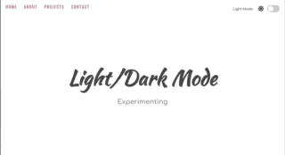

# Light/Dark Mode
Websites that have Dark Mode are my favorite. It is less painful on the eyes. So I created this project to play around with toggling between light/dark themes. It is a mock site, so please excuse the placeholder text and images. ^__^

## About
This is a mock website that toggles between light and dark mode. Below is a low quality gif, but I will have this available via Github Pages in case blurry gifs aren't your thing.

[Github Page to demo](https://hanabeth.github.io/light-dark-mode/)

## TODO:
*Notes to a future Hana that are put directly in the README to shame me for not doing it now v __ v Personal projects -> whenever I get time... and not playing around with something else I'm curious about.*
- Fix navigation/toggle bar to be responsive
- Update README with a demo giphy that has better pixel quality / higher frame rate. 

## Resources Used
[Hero Patterns - SVG for Background](https://www.heropatterns.com)

[unDraw - Images in 'About' Section](https://undraw.co/illustrations)

[Font Awesome - Social Media Icons in 'Contact' Section](https://fontawesome.com/)

## Finally
Meditate and be well.
